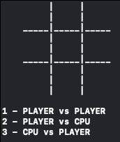

# Tic Tac Toe

This is a small project in which I built a Tic Tac Toe game for a terminal console. Since I am not completely comfortable with C++, there may be room for optimization. I have applied some SOLID concepts to make it easy to integrate into future mobile projects.

Currently, the player vs CPU mode can be a good challenge, although it may need improvement. Building the basic intelligence was a fun task.

In addition, I have added some unit tests for the intelligence to help me continuously improve the algorithm without any regressions.

